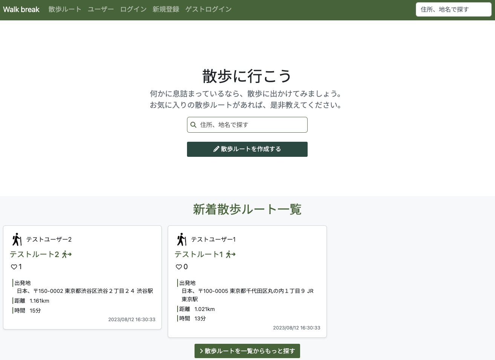
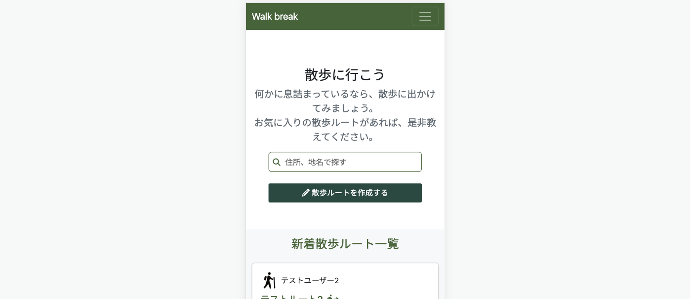
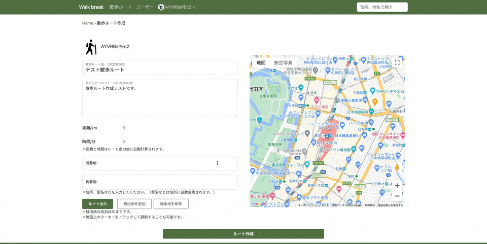
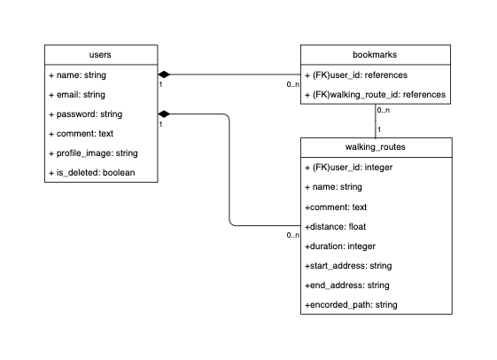

# Walk break
[Walk break](https://walkbreak-11323cd54fcf.herokuapp.com/)は、散歩ルートの作成・共有ができるアプリです。

- 散歩ルートはドラッグ&ドロップで詳細に編集可能です
- 作成された散歩ルートは検索やソート機能によって探索し、ブックマークが可能です
- レスポンシブ対応済みのため、スマートフォンでもご利用可能です

## 目次
1. About
2. 散歩ルート作成方法
3. 使用技術
4. UMLクラス図
5. 機能、テスト一覧
6. 今後追加したい機能

## 1. About
「Walk break」という名前は、「Coffee break」から取りました。 
この名前には、コーヒーを飲むのと同じくらい手軽に散歩を休憩として取り入れて欲しいという思いを込めています。

在宅勤務が当たり前となり、運動不足や仕事とプライベートの切り替えの難しさなどがしばし議論されている世の中で、私は散歩という運動に様々な可能性があると考えています。

まず健康面では、以下のメリットがあります。※1
- 歩くことは脂肪燃焼の面でとても良いアプローチ
- ランニングに比べて強度が低いためハードルが低く手軽に始めることができ、怪我にも繋がりにくい
- 適度な運動が睡眠の質を上げる

さらに有酸素運動によって脳に酸素が供給され脳が活性化することで、以下のメリットがあります。※2
- 創造的になり、アイデアが浮かびやすくなる
- 運動後の記憶力や注意力が向上し、生産性が上がる
- 緊張がとけ、精神的疲労や不安症状などの否定的な感情が低下する

スティーブ・ジョブズは考えごとをしたり、ブレスト的なミーティングをする際によく散歩を活用していたそうです。 
またヘンリー・デイヴィッド・ソローという作家は、「足が動くと、私の考えも流れ始めます」という言葉を残しています。 
デスクワークの休憩時、何か行き詰まった時など、ぜひWalk breakで見つけた散歩コースを歩いてみて欲しいです。

※1 
沢井製薬「脂肪がどんどん燃える 意外な運動のコツ」(2016年5月(2019年改訂)) 
https://kenko.sawai.co.jp/body-care/201605.html

日経Gooday「ゆっくり歩くほうが脂肪が燃焼する」というのは本当？」 
https://gooday.nikkei.co.jp/atcl/report/15/071300026/062300395/?P=2

※2 
米国疾病管理予防センター（CDC）「Walking」 
https://www.cdc.gov/physicalactivity/walking/index.htm

スタンフォード大学「Give your ideas some legs: The positive effect of walking on creative thinking.」 
https://psycnet.apa.org/doiLanding?doi=10.1037%2Fa0036577
https://www.apa.org/pubs/journals/releases/xlm-a0036577.pdf

国土交通省「第１章 「歩く」効果・効用とそれを習慣化する方法の整理」p14-15 
https://www.mlit.go.jp/common/000022977.pdf

The New Yorker「Why Walking Helps Us Think」 
https://www.newyorker.com/tech/annals-of-technology/walking-helps-us-think

## 2. 散歩ルート作成方法
- 出発地と到着地を入力し、ルート出力をクリックすることで以下の情報が自動で出力されます
  - ルート
  - 距離
  - 時間
- 必要に応じて10個まで経由地を追加することができます
- **散歩ルートはドラッグ&ドロップで詳細に編集可能です**

## 3. 使用技術
- HTML/CSS/JavaScript
- Bootstrap 5.2.3
- Ruby 2.7.6
- Ruby on rails 7.0.4.3
  - RSpec
  - SQLite 3.39.5
- Google Maps API
- AWS S3
- Heroku
  - Postgres 15.4

## 4. UMLクラス図

## 5. 機能、テスト一覧
- ユーザー関連
  - ユーザー登録、ログイン(devise)
  - 論理削除での退会
  - プロフィール作成
    - プロフィール画像アップロード(CarrierWave)
    - 作成済み散歩ルート一覧表示
    - ブックマーク一覧表示
  - ユーザー一覧表示
  - ユーザー名検索
  - ゲストログイン

- 散歩ルート関連(Maps JavaScript API)
  - 散歩ルート作成(Directions API)
  - 散歩ルート表示(geometryライブラリ)
  - 散歩ルート一覧表示
  - 散歩ルートソート(作成日時・ブックマーク数・距離・時間)
  - 住所・地名でのルート検索

- ブックマーク関連
  - ブックマークの追加・削除
  - 散歩ルートごとのブックマーク数表示

- 消費カロリー計算
  - ユーザーの体重をもとに散歩ルートごとに消費カロリーを表示 
  ※消費カロリーの計算はMETsを使用 
  生活活動のメッツ表（厚生労働省） 
  https://e-kennet.mhlw.go.jp/wp/wp-content/themes/targis_mhlw/pdf/mets.pdf 
  消費カロリーの計算にはMETsを使おう（森永製菓） 
  https://www.morinaga.co.jp/protein/columns/detail/?id=75&category=muscle

- テスト
  - RSpec
    - 単体テスト(spec/models)
    - 機能テスト(spec/requests)
    - 統合テスト(spec/system)

## 6. 今後追加したい機能
### ユーザーランキング
- [ ] ユーザーごとの総消費カロリーランキング作成（ex.総距離）

### ログ機能
- [ ] ユーザーごとに実際に歩いた散歩ルート履歴の作成

### 検索バリエーションの追加
- [ ] 散歩ルートにタグ付け（例：緑が多い道）し、タグ情報で検索
- [ ] スマートフォンでの利用時、現在の位置情報から周辺の散歩ルートを検索

### その他ユーザー関連
- [ ] 管理ユーザー機能（退会ユーザーの復元）
- [ ] フォロー/フォロワー機能
- [ ] 散歩ルートページ上でブックマークしたユーザー一覧を表示
